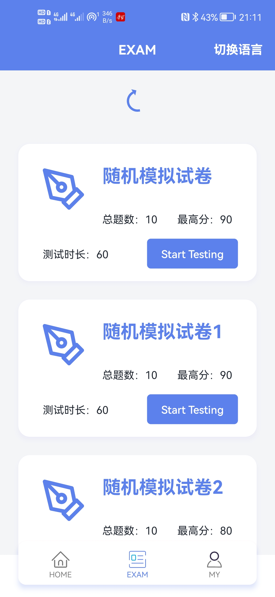

Chinatalk是一个提供给汉语学习者的安卓app, 主要提供多样化的答题功能，它通过集成了语音交互促进用户口语锻炼。

目前安卓端主要使用的技术栈有：Jetpack（ViewModel、Navigation）、用于动态申请权限的RxPermissions、异步框架RxJava2、UI库QMUI、代码简化butterknife、网络请求库retrofit、动画框架lottie、文件下载框架Aria、图片加载框架Glide、Bmob云短信服务、讯飞语音听写、讯飞语音合成、讯飞语音评测等。

服务端采用Nest进行开发，使用mysql数据库。

以下是已开发的部分界面截图：



### 调取网络接口

使用retrofit作为网络请求框架, 以exam接口为例: 

* 接口返回的数据格式: 

  ```json
  {
      "code": 200,
      "message": "查询成功",
      "data": {
          "papers":...
      }
   }
  ```

* 用ServiceResponse类来作为retrofit通用处理类

  ```java
  Observable<ServiceResponse<GettedExam>>
  ```

* 在api目录下编写Service接口

  ```java
  /**
   * 试卷相关接口
   */
  public interface ExamPaperService {
      /**
       * 查询所有模拟试卷
       */
      @GET("papers/hskmocks/with-user-score/all")
      Observable<ServiceResponse<GettedExam>> getAllHskMocksWithUserScoreAll();
  }
  ```

  此处采用RxJava书写风格(Observable)

* 在bean目录下编写实体和捕获类

  * 实体存放实体类，是一个业务体的具形抽象，比如试卷实体，用户实体

  * 捕获类是用于接收接口返回数据的类，与接口返回的data相对应。

    ```java
    public class GettedExam {
    
        private ArrayList<Exam> papers; // 与接口一致
    
        public ArrayList<Exam> getPapers() {
            return papers;
        }
    
        public void setPapers(ArrayList<Exam> papers) {
            this.papers = papers;
        }
    
        @Override
        public String toString() {
            return "GettedExam{" +
                    "papers=" + papers +
                    '}';
        }
    }
    ```

* 在exam/ExamViewModel中:

  这里RxJava风格的写法, 只需关注相关的部分即可

  ```java
  // ...
  private MutableLiveData<ExamResult> examResult;
  
  // ...
  Observable<ServiceResponse<GettedExam>> observable = new RetrofitClient.Builder().build().create(ExamPaperService.class).getAllHskMocksWithUserScoreAll();
          observable.subscribeOn(Schedulers.io())
                  .observeOn(AndroidSchedulers.mainThread())
                  .subscribe(new Observer<ServiceResponse<GettedExam>>() {
                      @Override
                      public void onSubscribe(Disposable d) {
  
                      }
  
                      @Override
                      public void onNext(ServiceResponse<GettedExam> examServiceResponse) {
                          Result<GettedExam> gettedExam = new Result.Success<>(examServiceResponse.getData());
                          if (gettedExam instanceof Result.Success) {
                              GettedExam data = ((Result.Success<GettedExam>) gettedExam).getData();
                              examResult.setValue(new ExamResult(new GettedInExamView(data.getPapers())));
                          } else {
                              examResult.setValue(new ExamResult(R.string.failed));
                          }
                      }
  
                      @Override
                      public void onError(Throwable e) {
  
                      }
  
                      @Override
                      public void onComplete() {
  
                      }
                  });
  ```

  * 在Next回调中可拿到接口的返回值
  * 用Result包裹一次返回接口可判断数据获取是否成功
  * 如果成功, 则将返回对象GettedExam从Result中取出,
  * 接着可对GettedExam做相应的二次处理
  * 处理结束后, 将值告知GettedInExamView类(向UI公开数据)

* 在ExamFragment中, 通过监听examResult来做出相应的UI变化

  ```java
  examViewModel.getExamResult().observe(getViewLifecycleOwner(), new Observer<ExamResult>() {
              @Override
              public void onChanged(ExamResult examResult) {
                  if (examResult.getError() != null) { // 展示出错信息
                      Toast.makeText(mContext, examResult.getError(), Toast.LENGTH_LONG).show();
                  }
                  if (examResult.getSuccess() != null) { // 登录成功,将数据公开给UI,UI拿到数据执行一些操作
                      Collections.shuffle(examResult.getSuccess().getExams());
                      mAdapter.setData(examResult.getSuccess().getExams());
                  }
              }
          });
  ```

  
